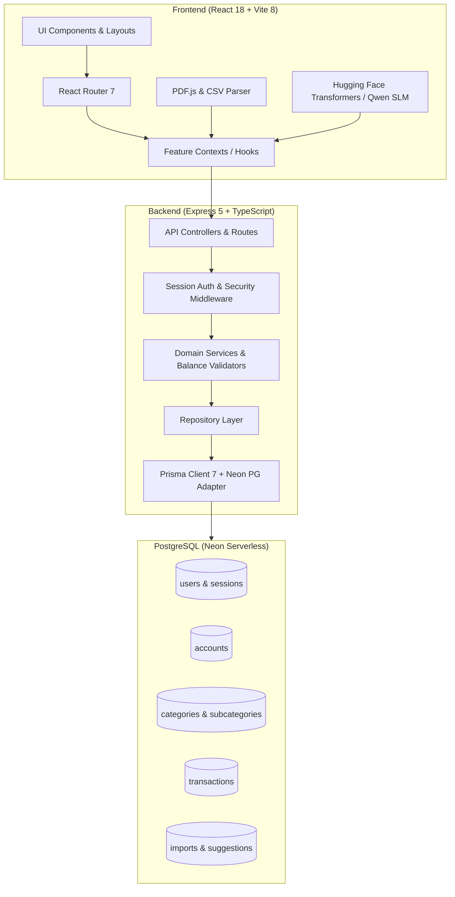
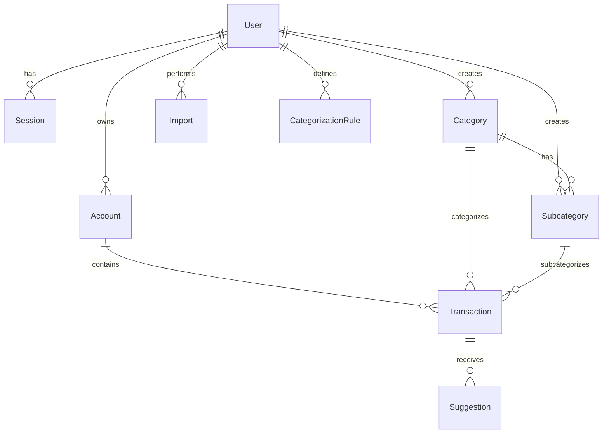

# Careers Empowered — Personal Finance Tracker

A full-stack, enterprise-grade personal finance and wealth management platform built with **React**, **Node.js/Express**, **Prisma ORM**, **PostgreSQL**, and **in-browser AI (Small Language Models)**. Designed with clean, modern aesthetics and a feature-first architecture, it provides multi-currency account tracking, transaction management, intelligent statement parsing (CSV/PDF) with duplicate detection, client-side ML categorization, and rich financial analytics.

---

## Table of Contents

- [Overview & Key Features](#overview--key-features)
- [Architecture & Tech Stack](#architecture--tech-stack)
- [Repository Structure](#repository-structure)
- [Prerequisites](#prerequisites)
- [Quick Start & Local Setup](#quick-start--local-setup)
- [Environment Variables Reference](#environment-variables-reference)
- [Database Setup, Migrations & Seeding](#database-setup-migrations--seeding)
- [API Reference](#api-reference)
- [AI / SLM Categorization Engine](#ai--slm-categorization-engine)
- [Testing & Quality Assurance](#testing--quality-assurance)
- [Design System & UI Brand Guidelines](#design-system--ui-brand-guidelines)
- [Engineering Standards & Best Practices](#engineering-standards--best-practices)
- [Troubleshooting & FAQ](#troubleshooting--faq)

---

## Overview & Key Features

### 1. Accounts & Multi-Currency Management
- **Multi-Account Tracking**: Manage Bank accounts, Credit Cards, Cash Wallets, and Investment accounts in one unified view.
- **Multi-Currency Support**: Real-time currency conversions and live exchange rate synchronization (`INR`, `USD`, `EUR`, `GBP`, etc.).
- **Inter-Account Transfers**: Atomic balance transfers between accounts with transaction history tracking.
- **Balance Adjustments**: Interactive balance correction modal with automated reconciliation adjustments.

### 2. Categories & Subcategories
- **Hierarchical Taxonomies**: Two-tier structure (`Parent Category` ➔ `Subcategories`) for both `INCOME` and `EXPENSE` flows.
- **Customizable Appearance**: Custom icons and curated color palettes per category.
- **Smart Aliases**: Assign keywords and merchant name aliases to categories for automatic rule-based matching.
- **Default & Custom Sets**: Pre-seeded standard categories with full support for user-defined custom categories.

### 3. Transaction Management
- **Comprehensive CRUD**: Record, edit, filter, and delete transactions with real-time balance updates.
- **Advanced Filtering**: Filter by date range, account, transaction type, category, or keyword search.
- **Balance Invariant Validation**: Strict backend checks preventing invalid balances and illegal state transitions.
- **Summary & KPI Aggregates**: Real-time computation of net balance, total income, total expense, and transaction counts.

### 4. Intelligent Statement Import & Deduplication
- **Multi-Format Ingestion**: Drag-and-drop ingestion of **CSV** and **PDF** bank statements.
- **Client-Side Parsing**: Secure in-browser document parsing using PDF.js and CSV parser without uploading raw files to third-party services.
- **Interactive Mapping**: Live column mapping, account selector, and data validation before committing to database.
- **Two-Phase Duplicate Detection**:
  1. *In-batch duplicate detection* across parsed rows.
  2. *Database duplicate check* querying existing records matching Account + Date + Title + Amount.

### 5. Hybrid Categorization (Rule + Fuzzy + Client-Side SLM)
- **Tier 1 (Rule-Based)**: Instant regular expression and keyword matcher against user rules.
- **Tier 2 (Fuzzy Backend Matcher)**: Levenshtein/token-based alias matcher for high-confidence matches.
- **Tier 3 (In-Browser SLM)**: On-device Small Language Model (powered by Hugging Face `@huggingface/transformers` running a quantized Qwen model) for zero-latency, privacy-preserving offline inference.

### 6. Analytics & Dashboard
- **Executive Summary Cards**: Net Worth, Total Liquid Balance, Monthly Inflows, Monthly Outflows, and Savings Rate.
- **Interactive Spending Breakdown**: Category-wise distribution charts with percentage shares.
- **Cash Flow Trends**: Month-over-month trend visualization.
- **Daily Drilldown**: Date-by-date expense inspection and transaction itemization.

---

## Architecture & Tech Stack



### Core Technologies

| Layer | Technologies | Description |
| :--- | :--- | :--- |
| **Frontend** | React 18, TypeScript, Vite 8 | Single Page Application with fast HMR |
| **Routing** | React Router v7 | Nested layouts, protected routes, declarative navigation |
| **Styling** | Vanilla CSS + Design Tokens | Custom CSS design system, CSS variables, typography |
| **AI / ML** | `@huggingface/transformers` | Client-side Quantized Qwen SLM for transaction categorization |
| **Document Processing** | `pdfjs-dist`, `jspdf` | Client-side bank statement extraction and PDF generation |
| **Backend API** | Node.js, Express 5, TypeScript | REST API with layered/clean architecture |
| **Database ORM** | Prisma 7 (`@prisma/client`, `@prisma/adapter-pg`) | Type-safe queries, migrations, and connection pooling |
| **Database** | PostgreSQL / Neon Serverless | Cloud-native relational database |
| **Testing** | Vitest, Testing Library, Playwright | Unit, component, integration, and end-to-end tests |

---

## Repository Structure

```
personal-finance-tracker/
├── backend/                        # Express 5 + TypeScript Backend API
│   ├── src/
│   │   ├── api/                    # Express controllers & route definitions
│   │   │   ├── account.controller.ts
│   │   │   ├── account.routes.ts
│   │   │   ├── auth.controller.ts
│   │   │   ├── auth.routes.ts
│   │   │   ├── category-matcher.controller.ts
│   │   │   ├── category-matcher.routes.ts
│   │   │   ├── category.controller.ts
│   │   │   ├── category.routes.ts
│   │   │   ├── dashboard.controller.ts
│   │   │   ├── dashboard.routes.ts
│   │   │   └── transactions.ts
│   │   ├── application/            # Application & business service layer
│   │   │   ├── account.service.ts
│   │   │   ├── category-matcher.service.ts
│   │   │   ├── category.service.ts
│   │   │   ├── currency.service.ts
│   │   │   └── dashboard.service.ts
│   │   ├── domain/                 # Domain logic & business invariants
│   │   │   └── accounts/
│   │   │       ├── balanceValidator.ts
│   │   │       └── balanceValidator.test.ts
│   │   ├── features/               # Feature-sliced modules (Transactions, etc.)
│   │   │   └── transactions/
│   │   │       ├── controller.ts
│   │   │       ├── routes.ts
│   │   │       ├── service.ts
│   │   │       └── types.ts
│   │   ├── infrastructure/         # Database connections & drivers
│   │   │   └── postgres/
│   │   │       ├── db.ts           # Direct PG pool connection
│   │   │       └── prisma.ts       # Prisma client instance with adapter
│   │   ├── repositories/           # Data access repository layer
│   │   │   ├── account.repository.ts
│   │   │   ├── category.repository.ts
│   │   │   └── dashboard.repository.ts
│   │   ├── security/               # Authentication middleware & hashing
│   │   │   ├── auth.middleware.ts
│   │   │   ├── authMiddleware.ts
│   │   │   └── password.ts
│   │   ├── index.ts                # Standalone entry point
│   │   └── server.ts               # Primary backend bootstrap server
│   ├── tests/                      # Backend E2E & integration tests
│   ├── package.json
│   ├── tsconfig.json
│   └── .env
│
├── database/                       # Prisma Schema, Migrations & Seeds
│   ├── migrations/                 # Versioned SQL migration history
│   │   ├── 0_init/
│   │   └── 20260814085716_add_categories_and_subcategories/
│   ├── prisma/
│   │   └── schema.prisma           # Prisma data models & enums
│   ├── seeds/                      # SQL seed data (default categories, etc.)
│   │   ├── default-categories.sql
│   │   └── category-e2e-test.sql
│   ├── prisma.config.ts            # Prisma 7 config
│   ├── package.json
│   └── .env
│
├── frontend/                       # React 18 + Vite 8 SPA
│   ├── src/
│   │   ├── app/
│   │   │   └── routing/            # React Router v7 routes & ProtectedRoute
│   │   ├── brand/
│   │   │   └── config/brand.ts     # Brand colors, typography & tokens
│   │   ├── features/               # Feature modules
│   │   │   ├── accounts/           # Multi-currency accounts & transfers
│   │   │   ├── auth/               # User registration, login, session state
│   │   │   ├── categories/         # Categories & subcategories management
│   │   │   ├── categorization/     # Categorization rules & suggestions
│   │   │   ├── dashboard/          # Analytics, summary cards & charts
│   │   │   ├── import/             # Statement import, PDF/CSV parser & SLM
│   │   │   └── transactions/       # Transaction CRUD, filters & modals
│   │   ├── hooks/                  # Shared React hooks
│   │   ├── layouts/                # App layout wrappers (Sidebar, Shell)
│   │   ├── services/               # Shared API client services
│   │   ├── shared/                 # Reusable UI components & dialogs
│   │   ├── test/                   # Test configuration & setup
│   │   ├── types/                  # Global TypeScript type declarations
│   │   ├── utils/                  # Common utilities & helpers
│   │   ├── index.css               # Global design tokens & CSS system
│   │   └── main.tsx                # React root entry point
│   ├── tests/                      # Playwright E2E test specs
│   ├── playwright.config.ts        # Playwright runner configuration
│   ├── vite.config.ts              # Vite & Vitest configuration
│   ├── tsconfig.json
│   └── package.json
│
├── docs/                           # Architecture, API & DB Documentation
├── package.json                    # Root workspace package.json
└── README.md                       # Project documentation
```

---

## Prerequisites

Ensure you have the following installed on your machine:

- **Node.js**: `v18.0.0` or higher (`v20+ LTS` recommended)
- **npm**: `v9.0.0` or higher
- **PostgreSQL**: A running PostgreSQL instance or a free [Neon](https://neon.tech) serverless database connection.

---

## Quick Start & Local Setup

Follow these steps to get the entire application up and running locally:

### Step 1: Clone the Repository
```bash
git clone https://github.com/dhars/personal-finance-tracker.git
cd personal-finance-tracker
```

### Step 2: Configure Environment Files

1. **Backend Environment** (`backend/.env`):
   ```env
   PORT=3000
   DATABASE_URL="postgresql://<user>:<password>@<host>/<database>?sslmode=require"
   ```

2. **Database Environment** (`database/.env`):
   ```env
   DATABASE_URL="postgresql://<user>:<password>@<host>/<database>?sslmode=require"
   ```

3. **Frontend Environment** (`frontend/.env`):
   ```env
   VITE_API_URL=http://localhost:3000/api
   VITE_ENABLE_SLM_CATEGORY_SUGGESTION=true
   ```

### Step 3: Install Dependencies

Open separate terminals or run from root:

```bash
# Install backend dependencies
cd backend
npm install

# Install database dependencies & generate Prisma client
cd ../database
npm install
npx prisma generate

# Install frontend dependencies
cd ../frontend
npm install
```

### Step 4: Run Database Migrations & Seeds

```bash
cd database
# Run pending migrations
npx prisma migrate deploy

# (Optional) Apply default category seeds if setting up a fresh database
# You can execute database/seeds/default-categories.sql via your PostgreSQL client or psql CLI
```

### Step 5: Start the Development Servers

**Terminal 1 — Backend API**:
```bash
cd backend
npm run dev
# Server starts on http://localhost:3000
# Verifiable at http://localhost:3000/health
```

**Terminal 2 — Frontend Application**:
```bash
cd frontend
npm run dev
# Vite dev server runs at http://localhost:5173
```

Now open **[http://localhost:5173](http://localhost:5173)** in your browser!

> [!TIP]
> **Default Test Account**: On initial bootstrap, the backend automatically ensures a dummy user exists (`dummy@finance.local` / ID: `9a1b181c-d789-4d6b-873f-c12140a32456`) so you can explore accounts and features immediately. You can also register a new account on `/auth`.

---

## Environment Variables Reference

### Backend (`backend/.env`)

| Variable | Type | Default | Description |
| :--- | :--- | :--- | :--- |
| `PORT` | `number` | `3000` | Port on which the Express server listens. |
| `DATABASE_URL` | `string` | *Required* | PostgreSQL connection string (supports Neon connection pooling). |

### Database (`database/.env`)

| Variable | Type | Default | Description |
| :--- | :--- | :--- | :--- |
| `DATABASE_URL` | `string` | *Required* | Connection string used by Prisma CLI for migrations & introspection. |

### Frontend (`frontend/.env`)

| Variable | Type | Default | Description |
| :--- | :--- | :--- | :--- |
| `VITE_API_URL` | `string` | `http://localhost:3000/api` | Base URL for REST API endpoints. |
| `VITE_ENABLE_SLM_CATEGORY_SUGGESTION` | `boolean` | `true` | Enables/disables client-side Small Language Model AI categorization. |

---

## Database Setup, Migrations & Seeding

The application uses **Prisma 7** with PostgreSQL.

### Core Database Models



- **`User`**: User profile credentials (email, hashed password, Google OAuth ID).
- **`Session`**: Active auth sessions with Bearer tokens and 24-hour expiration.
- **`Account`**: Bank, cash, and card accounts with balances, currency codes, and primary account flags.
- **`Category`**: Parent categories (`INCOME` / `EXPENSE`), icons, colors, aliases, and default flags.
- **`Subcategory`**: Child subcategories tied to a parent category.
- **`Transaction`**: Income/expense line items with decimal amounts, dates, accounts, and category links.
- **`Import`**: Statement import batch tracking with valid/invalid row counts and status.
- **`CategorizationRule`**: User-defined rule engine definitions.
- **`Suggestion`**: AI and rule-generated category suggestions with confidence scores.

### Common Prisma Commands

All database management commands should be executed from the `database/` directory:

```bash
# Generate Prisma Client (after modifying schema.prisma)
npx prisma generate

# Create and apply a new migration during development
npx prisma migrate dev --name <migration_name>

# Apply pending migrations in staging/production
npx prisma migrate deploy

# Launch Prisma Studio GUI to inspect/edit database tables visually
npx prisma studio
```

---

## API Reference

All protected endpoints require an `Authorization: Bearer <session_token>` header.

### 1. Authentication (`/api/auth`)

| Method | Endpoint | Auth | Description | Payload / Params |
| :--- | :--- | :--- | :--- | :--- |
| `POST` | `/api/auth/register` | No | Register a new user | `{ email, password, name? }` |
| `POST` | `/api/auth/login` | No | Authenticate user & create session | `{ email, password }` |
| `POST` | `/api/auth/logout` | Yes | Invalidate active session token | Headers: `Authorization: Bearer <token>` |
| `GET` | `/api/auth/me` | Yes | Get authenticated user profile | Returns `{ id, email }` |

### 2. Accounts (`/api/accounts`)

| Method | Endpoint | Auth | Description | Payload / Params |
| :--- | :--- | :--- | :--- | :--- |
| `GET` | `/api/accounts` | Yes | List all accounts with balances | Query: `?currency=USD` (optional) |
| `POST` | `/api/accounts` | Yes | Create a new financial account | `{ name, currency, balance, isPrimary? }` |
| `GET` | `/api/accounts/:id` | Yes | Retrieve single account details | URL parameter `:id` |
| `PUT` | `/api/accounts/:id` | Yes | Update account name/details | `{ name, currency, isPrimary? }` |
| `PATCH` | `/api/accounts/:id/balance` | Yes | Direct balance correction | `{ balance, reason? }` |
| `POST` | `/api/accounts/transfer` | Yes | Transfer money between accounts | `{ fromAccountId, toAccountId, amount }` |
| `DELETE` | `/api/accounts/:id` | Yes | Delete an account (cascades) | URL parameter `:id` |

### 3. Categories & Subcategories (`/api/categories`)

| Method | Endpoint | Auth | Description | Payload / Params |
| :--- | :--- | :--- | :--- | :--- |
| `GET` | `/api/categories` | Yes | List all categories + subcategories | Optional query: `?type=INCOME\|EXPENSE` |
| `POST` | `/api/categories` | Yes | Create custom parent category | `{ name, type, icon?, color?, aliases? }` |
| `PUT` | `/api/categories/:id` | Yes | Update category metadata | `{ name, icon?, color?, aliases? }` |
| `DELETE` | `/api/categories/:id` | Yes | Delete category and subcategories | URL parameter `:id` |
| `POST` | `/api/categories/:id/subcategories` | Yes | Create subcategory under parent | `{ name, icon?, color?, aliases? }` |
| `PUT` | `/api/categories/subcategories/:id` | Yes | Update subcategory | `{ name, icon?, color?, aliases? }` |
| `DELETE` | `/api/categories/subcategories/:id` | Yes | Delete subcategory | URL parameter `:id` |

### 4. Transactions (`/api/transactions`)

| Method | Endpoint | Auth | Description | Payload / Params |
| :--- | :--- | :--- | :--- | :--- |
| `GET` | `/api/transactions` | Yes | Query & filter transactions | `?type=&categoryId=&accountId=&startDate=&endDate=&search=&page=&limit=` |
| `POST` | `/api/transactions` | Yes | Create new transaction | `{ accountId, categoryId, subcategoryId?, amount, type, date, title }` |
| `PUT` | `/api/transactions/:id` | Yes | Update existing transaction | `{ accountId?, categoryId?, subcategoryId?, amount?, type?, date?, title? }` |
| `DELETE` | `/api/transactions/:id` | Yes | Delete transaction | URL parameter `:id` |
| `GET` | `/api/transactions/summary` | Yes | Get aggregate income/expense totals | Returns `{ totalIncome, totalExpense, netBalance, ... }` |
| `POST` | `/api/transactions/check-existing` | Yes | Batch duplicate check before import | `[ { accountId, date, title, amount, type } ]` |

### 5. Smart Category Matcher (`/api/category-matcher`)

| Method | Endpoint | Auth | Description | Payload / Params |
| :--- | :--- | :--- | :--- | :--- |
| `POST` | `/api/category-matcher/match` | Yes | Match transaction title to category | `{ description: "Uber Ride", type: "EXPENSE" }` |

### 6. Dashboard & Analytics (`/api/dashboard`)

| Method | Endpoint | Auth | Description | Payload / Params |
| :--- | :--- | :--- | :--- | :--- |
| `GET` | `/api/dashboard` | Yes | Fetch summary metrics & breakdowns | Query: `?period=thisMonth\|lastMonth\|yearToDate` |
| `GET` | `/api/dashboard/date/:date` | Yes | Get transactions for specific date | URL param `:date` (`YYYY-MM-DD`) |

---

## AI / SLM Categorization Engine

This project features an on-device **Small Language Model (SLM)** architecture for automated transaction categorization:

```
[Transaction Description] (e.g. "WHOLEFDS SOMA SAN FRANCISCO")
                  │
                  ▼
       ┌─────────────────────┐
       │ 1. Rule Matcher     │── Match Found (Confidence: 1.0) ──► Category Assigned
       └─────────────────────┘
                  │ No Match
                  ▼
       ┌─────────────────────┐
       │ 2. Backend Matcher  │── Confidence >= 0.85 ────────────► Category Assigned
       └─────────────────────┘
                  │ Low / No Match
                  ▼
       ┌─────────────────────┐
       │ 3. In-Browser SLM   │── Quantized Qwen Web Transformer ─► Suggested with Badge
       └─────────────────────┘
```

1. **Rule Engine** (`ruleCategorizationService.ts`): Immediate matching using regex and custom keyword heuristics.
2. **Backend Alias Matcher** (`categoryMatcherService.ts`): Compares normalized description tokens against pre-configured category aliases.
3. **Local In-Browser Transformer** (`qwenProvider.ts`): Uses `@huggingface/transformers` to run a quantized model locally in the user's browser, eliminating API latency and preserving complete financial privacy.

---

## Testing & Quality Assurance

We maintain comprehensive test coverage across both unit, integration, and E2E tiers.

### Frontend Unit & Component Tests (Vitest + React Testing Library)
```bash
cd frontend

# Run all unit/component tests in watch mode
npm run test

# Run tests once (CI mode)
npm run test:run

# Run tests with code coverage report
npm run test:coverage

# Launch Vitest visual UI dashboard
npm run test:ui
```

### End-to-End Tests (Playwright)
```bash
cd frontend

# Run Playwright end-to-end tests headless
npx playwright test

# Run Playwright tests in UI mode
npx playwright test --ui
```

### Backend Tests & Type Checking
```bash
cd backend

# Run backend unit/e2e tests
npx vitest run

# Run TypeScript compilation check without emitting files
npm run typecheck
```

---

## Design System & UI Brand Guidelines

The application adheres to the **Careers Empowered** design system defined in `frontend/src/brand/config/brand.ts` and `frontend/src/index.css`:

### Color Palette
- **Primary / Accent**: `#d38333` (Warm Ochre / Orange)
- **Primary Hover**: `#b56e29`
- **Secondary / Charcoal**: `#231F20` (Dark Charcoal / Sidebar)
- **Background**: `#f4f5f7` (Soft Light Grey)
- **Text Dark**: `#231F20`
- **Text Muted**: `#7f8c8d`
- **Divider**: `#2d2a2b`

### Typography
- **Logos / Brand**: `DM Sans`, sans-serif
- **Headings & Metric Displays**: `Source Sans 3`, sans-serif
- **Body & Data Tables**: `Poppins`, sans-serif

### Design Principles
- **Financial Precision**: Monetary values are formatted with standardized currency symbols and thousand-separators (`$`, `₹`, `€`, `£`).
- **Responsive Layout**: Fluid flex/grid layouts supporting both desktop multi-column and compact viewport configurations.
- **Glassmorphic Accents**: Subtle elevation, border radii (`8px` - `12px`), and soft box-shadows.

---

## Engineering Standards & Best Practices

1. **Monetary Precision**:
   - **Never** perform floating-point arithmetic directly for balance reconciliations.
   - Use `Decimal(15, 2)` types in Prisma / PostgreSQL.
   - Always validate balance updates through `balanceValidator.ts`.
2. **Layered Architecture (Backend)**:
   - **Controllers** handle HTTP requests, validate input schemas, and dispatch HTTP status codes.
   - **Services** contain core domain business logic and transactions.
   - **Repositories** interact with the database via Prisma or SQL pool queries.
3. **Feature-Sliced Architecture (Frontend)**:
   - Co-locate components, hooks, styles, types, and tests within their respective `src/features/<feature_name>/` folder.
   - Keep global utilities and shared UI components in `src/shared/` and `src/utils/`.
4. **Type Safety**:
   - Strict TypeScript enabled. Avoid `any` wherever possible.
   - Reuse shared DTO interfaces between frontend and backend.

---

## Troubleshooting & FAQ

### 1. `DATABASE_URL is not configured` error on backend start
**Cause**: Missing or malformed `.env` file.
**Solution**: Ensure `backend/.env` and `database/.env` exist and contain a valid PostgreSQL connection string.

### 2. Prisma Client out of sync with schema
**Cause**: Schema changes were made without running generation.
**Solution**: Run `cd database && npx prisma generate`.

### 3. In-Browser SLM model downloading slow on first import
**Cause**: The browser downloads the quantized model weights on initial execution and caches them locally in IndexedDB.
**Solution**: Allow the initial download (~20MB) to complete; subsequent classifications will load instantaneously from cache.

### 4. CORS Errors between Frontend & Backend
**Cause**: Backend CORS origin misconfiguration.
**Solution**: Ensure `server.ts` allows `http://localhost:5173` (Vite's default port) and that `VITE_API_URL` in frontend points to `http://localhost:3000/api`.

---
